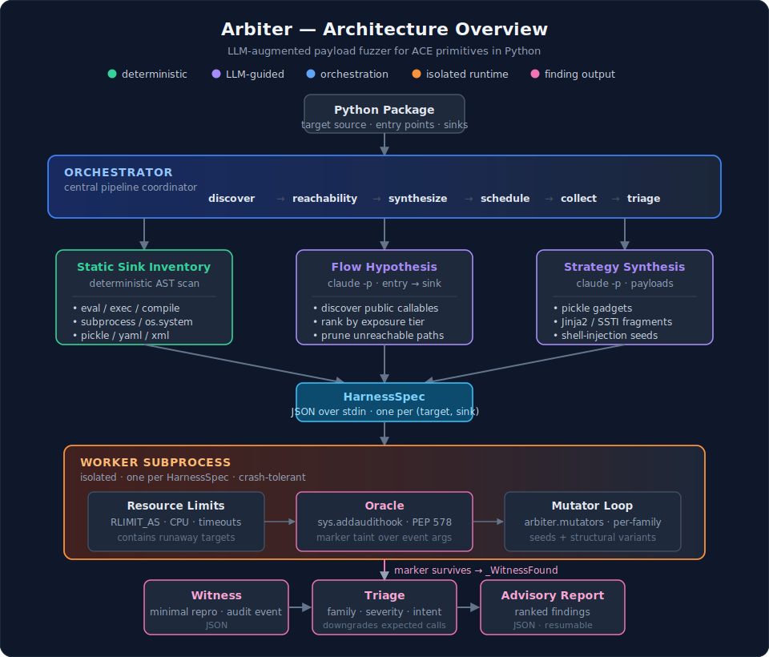

# Arbiter

**Arbiter** is an LLM-augmented property-based fuzzer designed to detect **Arbitrary Code Execution (ACE) primitives** in Python packages with high precision. 

Standard security tools often struggle with Python's dynamic nature, resulting in either too many false positives (static analysis) or missed vulnerabilities due to a lack of reachability context (dynamic fuzzing). Arbiter bridges this gap by combining LLM-guided reasoning with a high-precision runtime oracle.

---

## The Core Idea: Taint-Aware Fuzzing
Arbiter does not just look for crashes; it looks for **attacker-controlled influence** over dangerous sinks. 

1. **The Marker**: Every fuzzed input is embedded with a unique UUID4 "marker".
2. **The Oracle**: A runtime monitor uses `sys.addaudithook` to watch dangerous APIs like `eval()`, `subprocess.Popen()`, and `pickle.loads()`.
3. **The Proof**: A "witness" is only recorded if that specific marker survives into the arguments of a dangerous sink, providing concrete proof of an exploitable primitive.

---

## Design & Architecture
Arbiter is built as a multi-stage pipeline coordinated by a central orchestrator.

<p align="center">
  
</p>

### 1. Discovery & Reachability (The "Where")
* **Static Sink Inventory**: Arbiter performs a deterministic AST scan to find all dangerous API calls within a package.
* **LLM-Guided Discovery**: A Claude-powered agent explores the package to find public-facing entry points (CLIs, network handlers, etc.).
* **Reachability Analysis**: The LLM analyzes the call graph to determine if an entry point can plausibly reach a sink, filtering out thousands of "dead" paths to focus fuzzing resources.

### 2. Strategy Synthesis (The "How")
* **Domain-Specific Payloads**: For each valid flow, an LLM generates tailored seeds (e.g., specific `pickle` gadgets or Jinja2 SSTI fragments) instead of relying solely on random mutation.

### 3. Isolated Fuzzing (The "Proof")
* **Worker Subprocesses**: Fuzzing happens in isolated workers to prevent target crashes from killing the orchestrator.
* **Hypothesis Integration**: Arbiter uses property-based testing to mutate inputs and "shrink" failures into the smallest possible proof-of-concept input.

---

## Getting Started

### Install
Requires Python 3.12+.
```bash
uv pip install -e ".[dev]"
```

### Run a Scan
Arbiter reuses your existing Claude Code authentication; no separate API keys are required.

```bash
arbiter scan path/to/package --package-name mypkg --output-json result.json
```

See [`DESIGN.md`](DESIGN.md) for the architecture, threat model, detection
mechanism, and roadmap.

---

## License

See [`LICENSE`](LICENSE).
